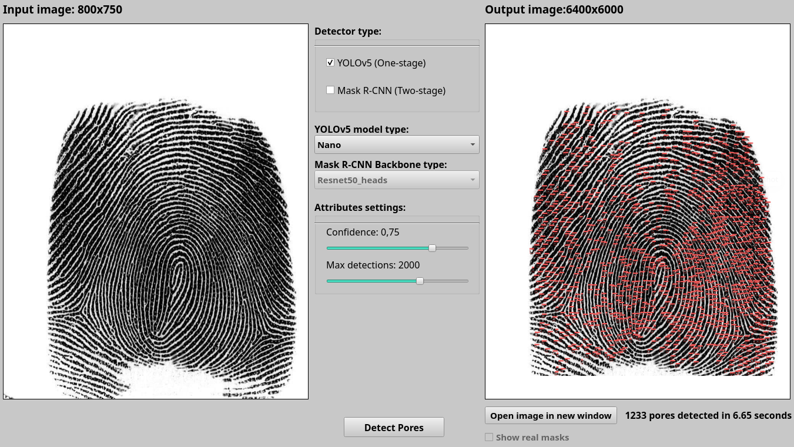
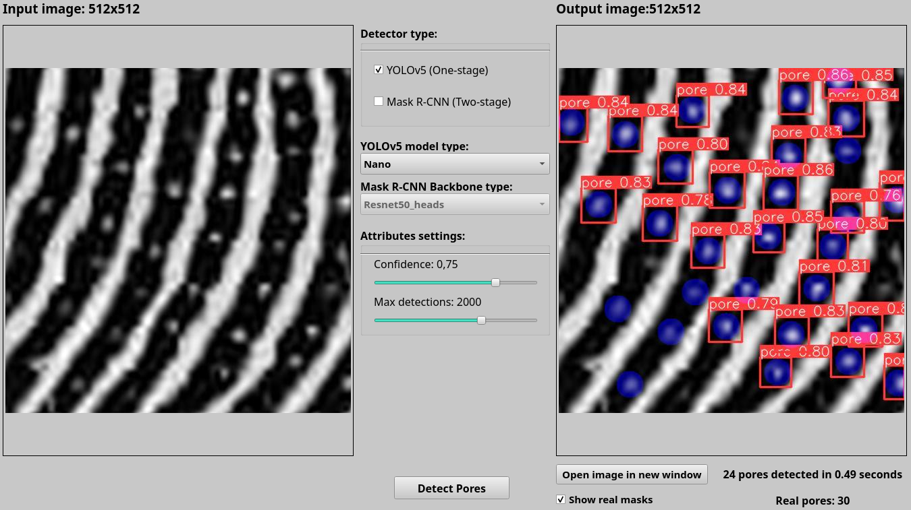

## <div align="center">Introduction</div>
This project was created to detect sweat pores on fingerprints images using One-stage detector YOLOv5 (Official repository: https://github.com/ultralytics/yolov5) and the Two-stage detector Mask R-CNN (Official repository: https://github.com/matterport/Mask_RCNN).

## <div align="center">Quick Start Examples</div>

<details open>
<summary>Install</summary>

Create Ancaonda environment with Python 3.8 and clone this repo and install [requirements.txt](https://github.com/ultralytics/yolov5/blob/master/requirements.txt) in a
[**Python>=3.8.0**](https://www.python.org/) environment, including
[**PyTorch>=1.7**](https://pytorch.org/get-started/locally/).

```bash
conda create --name=<name of environment> python=3.8
conda activate <name of environment>
git clone https://github.com/filipspes/Fingerprints_sweat_pores_detection  # clone
cd Fingerprints\_sweat\_pores\_detection
cd GUI
pip install -r requirements.txt  # install
conda install tensorflow-gpu cudatoolkit=10.1
python gui.py # run
```
IMPORTANT: Before you start application you have to change ROOT_DIR inside app_config.ini. This ROOT_DIR have to be changed, otherwise the application may not work properly. This folder should be the same as the one in which app_config.ini is located.

## <div align="center">Pretrained models</div>
This repository contains only two models. You can download mrcnn models from URL: https://mega.nz/folder/Ing3RaRA#UU66txug51g2RgQS7sl9Dg and YOLOv5 models from URL https://mega.nz/folder/piJXUIBQ#jUNc8qFzc109E0c-tEJbNg.
All models should have correct name and they should be in defined folders. YOLOv5 models should be in yolov5_models folder and mrcnn models should be in mrcnn_models folder.


## <div align="center">Welcome screen after start</div>


## <div align="center">Detections</div>
## <div align="left">Full image detected</div>
Image below shows the full image of fingeprints with detected sweat pores.

## <div align="left">Image part detected</div>
Image below shows the part of image of fingeprints with detected sweat pores.

## <div align="left">Real masks</div>
Image below shows the part of image of fingeprints with detected sweat pores and with real masks of sweat pores from JSON file.

